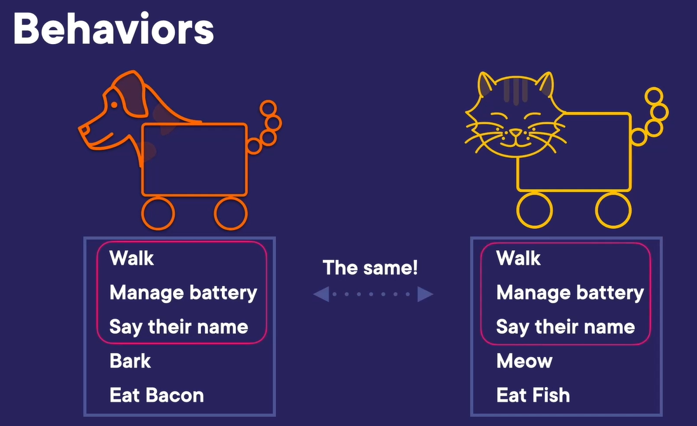
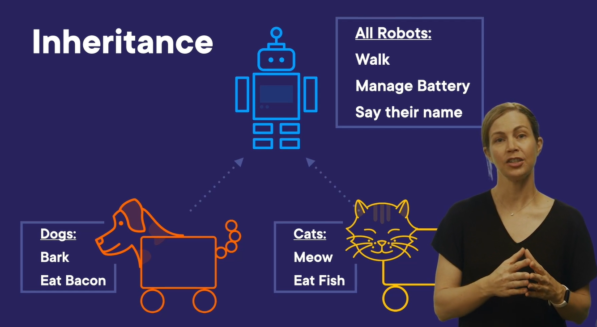

# python
python basics to advance modules

Folder: Class
In here there are files that are inter related, mentioned below
    1. employee.py
    2. company.py

Relationships in object oriented programming
    1. IS-a relationship
    2. Has-a relationship

1. IS-a relationship:
    A robot dog is a robot
    A robot cat is a robot

2. Has-a relationship:
    A company has employees
    A robot has a battery

Inheritance:
    
    Here, there are similarities between the two robots, which can be commonly included in a robot class and then inherited.
    

The folder Class/Inheritance is to work on this concept:
    When we include a class name as a parameter in a class declaration, it refers to the inheritance

Exceptions:

When there is a chance of code failure and still wants to handle the failure, rather than breaking, we use try/except/final

    try: # the code that we are not sure of failing is written here
    except: # what is to be done when the try block fails is defined here
    finally: # in any condition of success/failure if any set of code that has to run, it is declared here

Files:

We have flexibility to read/write a file.
We should be knowing the full path to the file
    1. IOS --> /users/username/Desktop/textfile.txt
           --> input.txt : this RELATIVE path can be used when file and code is in same folder
    2. windows --> c:/user/folder1/..../textfile.txt

    Open file: python has "open(<<full_path/relative_path>>)" to read a file
                this returns a file object that has methods like read() and write()

    Note: It is important to close() a file object that been opened

    Python has a special keyword "with" that makes sure the file is properly closed when the file operations are done even if an exception is raised.
    Eg: with open('<<file_path>>') as file:

    General way to close a file:
    Eg:     file = open('abcd.txt')
            try:
                # Do file operations here
                pass
            finally:
                file.close()

    #  read(): this method reads the file and return the content of the file
    #  readlines(): this method return the list of strings of all the lines in the file

    Acronyms.py is the best example to display the read and write functionality of a file